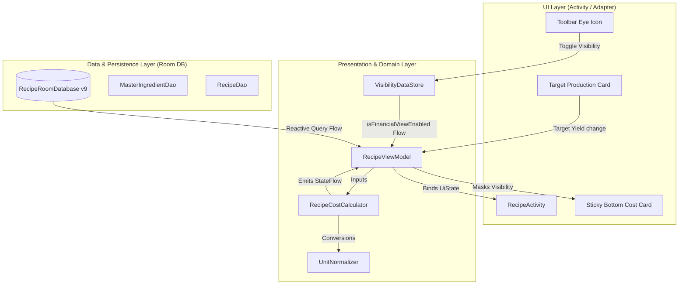
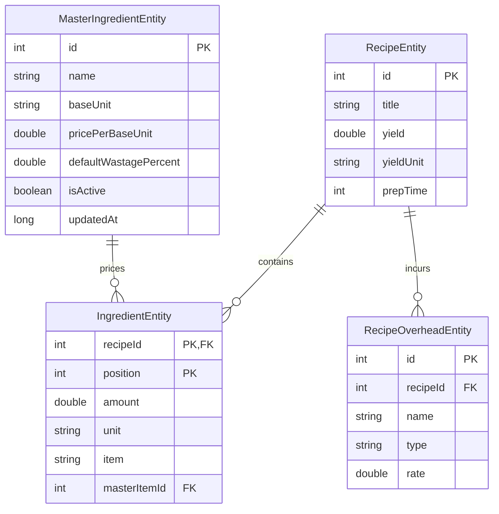

# Architecture Spine — Tournant Live Cost Calculator

## 1. Design Paradigm

The architecture adopts **Layered Android MVVM with Unidirectional Reactive Data Flow (UDF)**. 



---

## 2. Invariants & Rules

### AD-1 — Master Ingredient Soft Deletes & Foreign Key Protection `[ADOPTED]`
- **Binds:** `FR-2`, `FR-3`, `MasterIngredientEntity`, `IngredientEntity`, Room DAOs
- **Prevents:** Deletion of master items corrupting existing recipes or breaking historical costing links.
- **Rule:** `IngredientEntity.masterItemId` defines a nullable foreign key pointing to `MasterIngredientEntity.id` with `onDelete = ForeignKey.RESTRICT`. Deletion operations from user UI set `MasterIngredientEntity.isActive = false` (soft-delete). Physical database deletions are restricted and only permitted if the count of linked recipe ingredients is 0.

### AD-2 — Deterministic Multi-Dimensional Unit Normalization `[ADOPTED]`
- **Binds:** `FR-4`, `FR-5`, `UnitDimension`, `UnitNormalizer`, `RecipeCostCalculator`
- **Prevents:** Arithmetic rounding discrepancies and incompatible unit calculations (e.g. adding grams to milliliters without density normalization).
- **Rule:** All conversions must execute via the pure Kotlin `UnitNormalizer` singleton. Units belong strictly to one of three dimensions:
  - `MASS` (Base: `g`, Subunits: `kg` [1000g], `mg` [0.001g], `oz` [28.3495g], `lb` [453.592g])
  - `VOLUME` (Base: `ml`, Subunits: `L` [1000ml], `cl` [10ml], `dl` [100ml], `fl oz` [29.5735ml], `cup` [240ml], `tbsp` [15ml], `tsp` [5ml])
  - `COUNT` (Base: `pcs`, Subunits: `units` [1], `doz` [12])
  - *Fluid Density Fallback*: If converting between Volume and Mass for fluid liquids, apply standard density factor $1.0\text{ g/ml}$ ($1.0\text{ kg/L}$).

### AD-3 — Pure, Reactive Calculation Pipeline in ViewModel `[ADOPTED]`
- **Binds:** `FR-6`, `FR-7`, `FR-8`, `RecipeViewModel`, `RecipeCostCalculator`
- **Prevents:** UI thread blocking, out-of-sync calculations, and imperative manual refresh bugs.
- **Rule:** `RecipeViewModel` exposes a single immutable state:
  ```kotlin
  val costingUiState: StateFlow<RecipeCostUiState> = combine(
      recipeRepository.getRecipeWithCostingFlow(recipeId),
      targetYieldStateFlow,
      visibilityDataStore.isFinancialViewEnabledFlow
  ) { recipeData, targetYield, isVisible ->
      RecipeCostCalculator.compute(recipeData, targetYield, isVisible)
  }.stateIn(viewModelScope, SharingStarted.WhileSubscribed(5000), RecipeCostUiState.Loading)
  ```
  The calculation function must remain completely pure and runnable in JUnit unit tests without Android Context mocks.

### AD-4 — Zero-Leakage Front-of-House (FOH) Masking Contract `[ADOPTED]`
- **Binds:** `FR-9`, `FR-10`, `FR-11`, `SM-2`, `RecipeActivity`, Clipboard Export
- **Prevents:** Accidental exposure of profit margins or wholesale material costs to kitchen staff or external clipboard pastes.
- **Rule:** When `isFinancialViewEnabled == false`:
  1. `RecipeCostUiState.isFinancialVisible` is `false`, and all financial totals and line prices are set to `null`.
  2. UI elements (`bottomCostCard`, `overheadsContainer`, `ingredientUnitPriceText`) must be set to `View.GONE`.
  3. Clipboard generation formats plain kitchen cards (scaled ingredients + method directions), completely omitting financial columns and totals.

### AD-5 — Room Database Migration 8 $\rightarrow$ 9 Contract `[ADOPTED]`
- **Binds:** `RecipeRoomDatabase`, `MIGRATION_8_9`
- **Prevents:** Database migration crashes and data loss on existing user installations.
- **Rule:** `MIGRATION_8_9` must be explicitly declared in `RecipeRoomDatabase.kt` and tested with Room Migration Test Suite:
  ```sql
  CREATE TABLE IF NOT EXISTS `MasterIngredient` (
      `id` INTEGER PRIMARY KEY AUTOINCREMENT NOT NULL,
      `name` TEXT NOT NULL,
      `baseUnit` TEXT NOT NULL,
      `pricePerBaseUnit` REAL NOT NULL,
      `defaultWastagePercent` REAL NOT NULL DEFAULT 0.0,
      `isActive` INTEGER NOT NULL DEFAULT 1,
      `updatedAt` INTEGER NOT NULL
  );

  CREATE TABLE IF NOT EXISTS `RecipeOverhead` (
      `id` INTEGER PRIMARY KEY AUTOINCREMENT NOT NULL,
      `recipeId` INTEGER NOT NULL,
      `name` TEXT NOT NULL,
      `type` TEXT NOT NULL,
      `rate` REAL NOT NULL,
      PRIMARY KEY(`id`),
      FOREIGN KEY(`recipeId`) REFERENCES `Recipe`(`id`) ON UPDATE CASCADE ON DELETE CASCADE
  );
  CREATE INDEX IF NOT EXISTS `index_RecipeOverhead_recipeId` ON `RecipeOverhead` (`recipeId`);

  ALTER TABLE `Ingredient` ADD COLUMN `masterItemId` INTEGER DEFAULT NULL;
  CREATE INDEX IF NOT EXISTS `index_Ingredient_masterItemId` ON `Ingredient` (`masterItemId`);
  ```

### AD-6 — Extensible Multi-Type Overhead Engine `[ADOPTED]`
- **Binds:** `FR-7`, `RecipeOverheadEntity`, `OverheadType`
- **Prevents:** Hardcoded overhead math that fails to represent commercial realities (gas vs packaging vs wages).
- **Rule:** Overheads evaluate strictly according to `OverheadType`:
  $$\text{Cost}_{\text{Overhead}} = \sum \begin{cases} \text{rate} & \text{if FIXED} \\ \text{rate} \times \text{TargetYield} & \text{if PER\_KG\_YIELD} \\ \text{rate} \times \text{PrepTimeHours} & \text{if PER\_HOUR\_LABOR} \end{cases}$$

### AD-7 — Locale-Aware Currency Representation `[ADOPTED]`
- **Binds:** UI Adapters, `CurrencyFormatter`
- **Prevents:** Hardcoded currency symbols (e.g. ₹ vs $ vs €) breaking for international users.
- **Rule:** All price strings must format via `CurrencyFormatter.format(amount: Double, currencyCode: String?)`, defaulting to `NumberFormat.getCurrencyInstance(Locale.getDefault())` unless overridden in Tournant user preferences.

---

## 3. Structural Seed & Entity Relationships



---

## 4. Stack & Libraries

| Dependency / Component | Version / Specification | Role in Feature |
| :--- | :--- | :--- |
| **Kotlin** | `1.9.x` / Standard Coroutines | Language & Flow State Machines |
| **Android Room** | `2.6.x` | SQLite ORM, Schema Migration 8 $\rightarrow$ 9 |
| **AndroidX DataStore** | `1.0.x` Preferences | Persistent FOH Mode Visibility State |
| **Android Material Components** | Material 3 / MDC | CardViews, FAB, Menus, Dialogs |
| **JUnit 4 & Room Test** | Standard Android Test Runner | Unit Normalizer & Migration Verification |

---

## 5. Minimal Source Tree

```text
app/src/main/java/eu/zimbelstern/tournant/
  ├── data/
  │   ├── costing/
  │   │   ├── UnitDimension.kt          # MASS, VOLUME, COUNT definitions
  │   │   ├── UnitNormalizer.kt         # Conversion engine & density fallback
  │   │   ├── RecipeCostCalculator.kt   # Pure batch & yield scaling math
  │   │   ├── OverheadType.kt           # FIXED, PER_KG_YIELD, PER_HOUR_LABOR
  │   │   └── RecipeCostUiState.kt      # Immutable UI state models
  │   └── room/
  │       ├── MasterIngredientEntity.kt  # Raw material prices entity
  │       ├── RecipeOverheadEntity.kt    # Recipe overheads entity
  │       ├── MasterIngredientDao.kt     # Room queries for master price book
  │       ├── RecipeWithCostingData.kt   # Relational composite query class
  │       └── RecipeRoomDatabase.kt      # Migration 8->9 definition
  └── ui/
      ├── costing/
      │   ├── MasterInventoryActivity.kt # Price book CRUD screen
      │   ├── MasterInventoryAdapter.kt  # RecyclerView adapter
      │   └── OverheadsAdapter.kt        # Overheads list adapter in recipe
      └── RecipeActivity.kt             # Target Yield editor, Eye toggle, Bottom Card
```

---

## 6. Capability $\rightarrow$ Architecture Map

| Capability / Requirement | Component | Governed By |
| :--- | :--- | :--- |
| Master Price Management (FR-1, FR-2, FR-3) | `MasterInventoryActivity`, `MasterIngredientDao` | **AD-1, AD-5** |
| Unit Normalization (FR-4, FR-5) | `UnitNormalizer`, `UnitDimension` | **AD-2** |
| Target Yield & Cost Calculation (FR-6, FR-8) | `RecipeCostCalculator`, `RecipeViewModel` | **AD-3, AD-6** |
| Overheads Engine (FR-7) | `RecipeOverheadEntity`, `RecipeCostCalculator` | **AD-6** |
| FOH Privacy & Sanitized Copy (FR-9, FR-10, FR-11) | `RecipeActivity`, `VisibilityDataStore` | **AD-4** |
| Currency Display | `CurrencyFormatter` | **AD-7** |

---

## 7. Deferred Items

1. **OCR Invoice Parsing**: Pushed to future releases; manual price book entry is sufficient for v1.
2. **Dynamic Live Cloud Sync of Prices**: Relies on existing Tournant database sync mechanisms; dedicated real-time multi-device cloud replication is deferred.
3. **Complex Food Density Chemistry Tables**: Density beyond $1.0\text{ kg/L}$ for fluid liquids will be manual override in v2.
